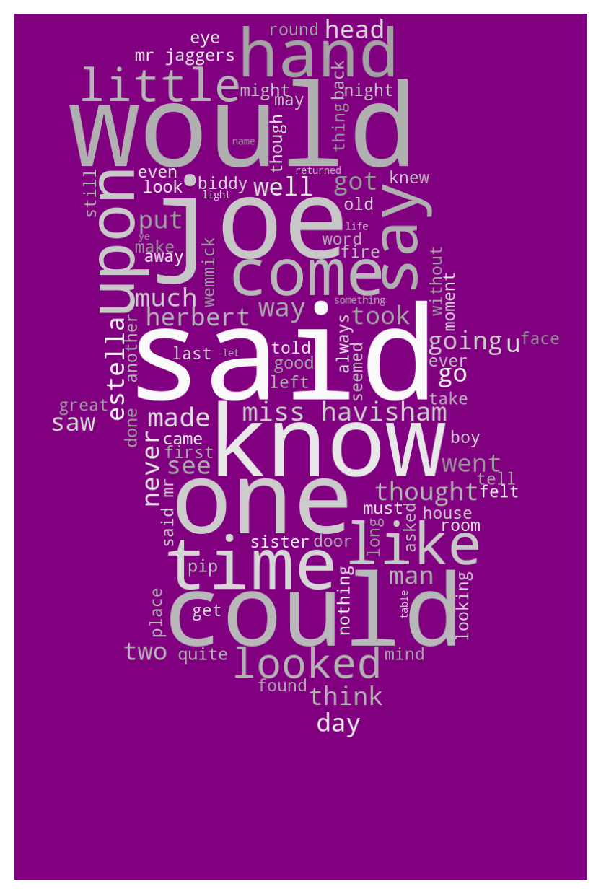

# Text_Analysis_Great_Exp
A Text analysis project for the infamous Charles Dickins novel The Great Expecations 
📖 Text Analysis of "Great Expectations"

Welcome to my latest project on text analysis of the novel "Great Expectations" by Charles Dickens. This project aims to analyze the language and sentiment of the novel using natural language processing (NLP) techniques.
🚀 Getting Started

To get started with this project, you will need to have the following dependencies installed on your machine:

    Python 3.6+
    pandas
    matplotlib
    seaborn
    nltk
    vaderSentiment

You can install these dependencies by running the following command in your terminal:

pip install pandas matplotlib seaborn nltk vaderSentiment

💻 Methods Used

This project uses the following methods for text analysis:

    VADER Sentiment Analysis: This is a rule-based sentiment analysis tool that is specifically designed for social media text. It uses a lexicon of words and their associated sentiment scores to determine the sentiment of a given text.
    Text Modeling: This involves building a statistical model of the text using machine learning algorithms such as Latent Dirichlet Allocation (LDA).
    Distribution Frequency: This involves analyzing the frequency distribution of words and phrases in the text.

📊 Results

The analysis of "Great Expectations" revealed some interesting insights about the novel, such as:

    The most frequent words in the novel are "said", "mr", "pip", "one", and "man".
    The sentiment of the novel is predominantly neutral, with occasional positive and negative peaks.
    The topics of the novel can be broadly classified into themes such as love, wealth, social class, and self-discovery.

📝 Conclusion

This project demonstrates the power of NLP techniques in analyzing literary texts. By applying sentiment analysis, text modeling, and distribution frequency techniques to "Great Expectations", we were able to gain a deeper understanding of the novel's language, sentiment, and themes.

I hope you find this project interesting and insightful. Any feedback or suggestions for improvement are welcome!

